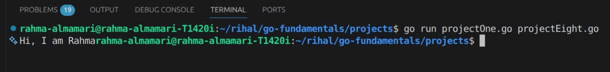
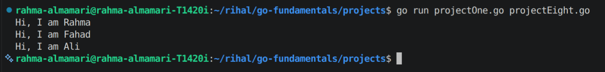
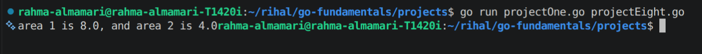
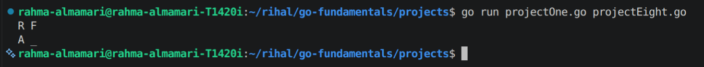

# Using Functions

## How to Create Function?

**Rule**

`func function_name(arguement_name arguement_dataType, ...){ //function logic }`

~~NOTE:~~

- We can have arguements as many as we want.
- We create the function outside the main function and then we can call it inside the main function or any other function.
- we can not create function inside anther function but we can call a function inside anther function.

## How to Call Function

**Rule**

`function_name(pass_needed_arguements)`

### Example:

```go
func show(n string){
    fmt.Printf("Hi, I am %v", n)
}

---

func main(){
    show("Hi, I am Rahma")
}
```

### Code Output:



## How to Used Function as Arguement

In Go we can pass a function to anther function as arguement 

### Example:

```go 
names := []string {"Rahma", "Fahad", "Ali"}
func sayHi(n string){
    fmt.Printf("Hi, I am %v \n", n)
}
func message(n []string, f func(string)){
    for _, v :=  range n{
        f(v)
    }
}

---

func main(){
    message(names, sayHi)
}
```

### Code Output:



## How to Create Function Which Reaturn Something?

When we create a function which will return something we have to write the data type of what it will return after the arguement bracket 

### Exampe:

```go
func area(r float64) float64{
return r*2
}

---

func main(){
    a1 := area(4)
    a2 := area(2)

    fmt.Printf("area 1 is %0.1f, and area 2 is %0.1f", a1, a2)
}
```

### Code Output:



## How to Create Function That Return Multiple Values?

In Go we can create a function which return multiple values by writing the data type of these returned values in () after arguements ().

### Example:

```go
func getTnitials(n string) (string, string) {
	upper := strings.ToUpper(n)
	words := strings.Split(upper, " ")

	var initials []string
	for _, v := range words {
		initials = append(initials, v[:1])
	}
	if len(initials) > 1 {
		return initials[0], initials[1]
	}
	return initials[0], "_"
}

---

func main(){
    fn1, sn1 := getTnitials("Rahma Fahad")
	fmt.Println(fn1, sn1)
	fn2, sn2 := getTnitials("Ali")
	fmt.Println(fn2, sn2)
}
```

### Code Output:

