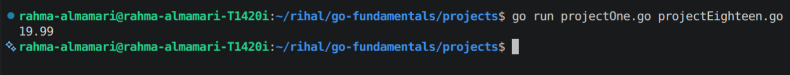
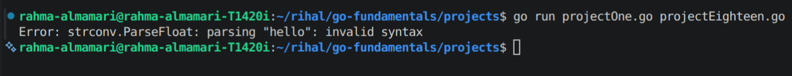

# Parsing Floats in Go

## What is Parsing?

**Parsing** means converting data from one type to another.

A common example is converting a **string** entered by the user into a **float** (`float64`).

---

# Why Parse Floats?

Sometimes numbers come as strings, such as:

```go
price := "19.99"
```

To perform calculations, you must convert the string to a float.

---

# Using `strconv.ParseFloat()`

The `strconv.ParseFloat()` function converts a string to a floating-point number.

**Syntax**

```go
strconv.ParseFloat(stringValue, bitSize)
```

- `stringValue` → the string to convert.
- `bitSize` → `32` for `float32` or `64` for `float64`.

---

# Example

```go
package main

import (
	"fmt"
	"strconv"
)

func main() {

	price := "19.99"

	value, err := strconv.ParseFloat(price, 64)

	if err != nil {
		fmt.Println("Invalid number")
		return
	}

	fmt.Println(value)
}
```

**Code Output:**



---

# Example: Invalid Input

```go
package main

import (
	"fmt"
	"strconv"
)

func main() {

	value, err := strconv.ParseFloat("hello", 64)

	if err != nil {
		fmt.Println("Error:", err)
		return
	}

	fmt.Println(value)
}
```

**Code Output:**




---

# Why Check for Errors?

Not every string is a valid number.

Checking `err` helps prevent your program from crashing when the input is invalid.

```go
value, err := strconv.ParseFloat(input, 64)

if err != nil {
	fmt.Println("Invalid input")
	return
}
```

---

# Important Notes

- `ParseFloat()` is part of the `strconv` package.
- It converts a **string** to a **float**.
- Always check the returned `error`.
- Use `64` for a `float64` result and `32` for a `float32` result.

---

# Summary

- Parsing means converting one data type to another.
- `strconv.ParseFloat()` converts a string to a floating-point number.
- Always check the returned `error` before using the value.
- Parsing is useful when reading numeric values from user input or files.