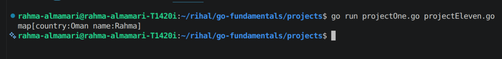
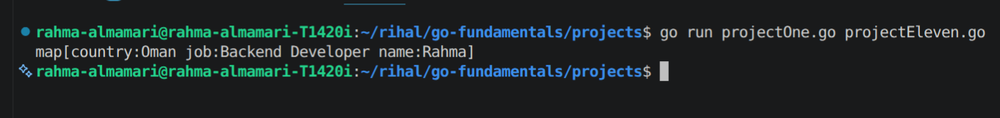
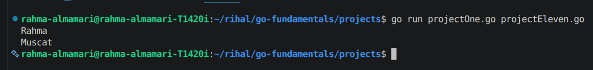
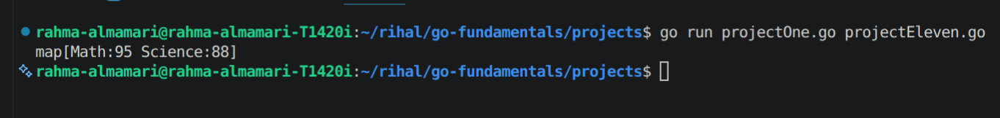
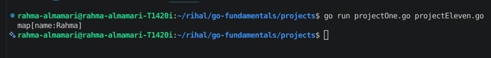
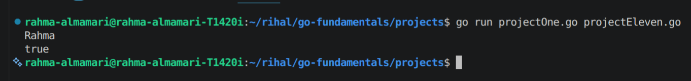
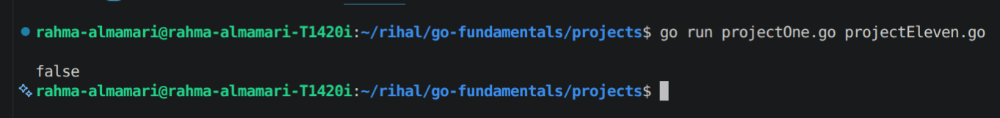
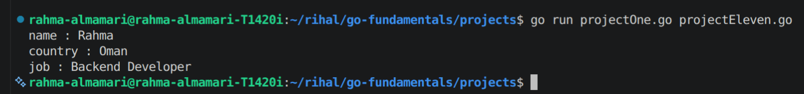
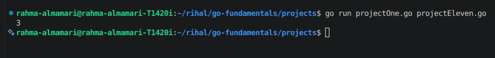
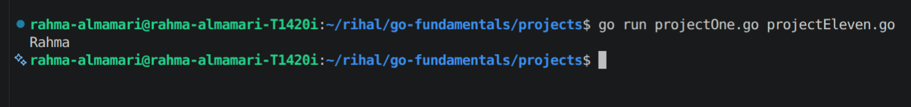

# Maps in Go

## What is a Map?

A **map** is a built-in data structure in Go that stores data as **key-value pairs**.

Think of a map like a dictionary:

- Each **key** is unique.
- Each key is associated with exactly one **value**.
- You use the key to quickly retrieve its corresponding value.

For example:

| Key | Value |
|------|-------|
| "name" | "Rahma" |
| "age" | 24 |
| "country" | "Oman" |

Unlike arrays and slices, maps do **not** use indexes. Instead, they use **keys**.

---

# Why Use Maps?

Maps are useful when you want to:

- Store related data using meaningful keys.
- Search for data quickly.
- Update values easily.
- Delete values.
- Count occurrences.
- Build lookup tables.

---

# How to Create a Map

## Using `make()` (Recommended)

**Syntax**

```go
mapName := make(map[keyType]valueType)
```

### Example

```go
package main

import "fmt"

func main() {
	user := make(map[string]string)

	user["name"] = "Rahma"
	user["country"] = "Oman"

	fmt.Println(user)
}
```

**Code Output:**



---

## Creating a Map with Initial Values

You can create and initialize a map in one step.

```go
package main

import "fmt"

func main() {
	user := map[string]string{
		"name":    "Rahma",
		"country": "Oman",
		"job":     "Backend Developer",
	}

	fmt.Println(user)
}
```

**Code Output:**



---

# Accessing Values

Use the key to retrieve its value.

```go
package main

import "fmt"

func main() {
	user := map[string]string{
		"name": "Rahma",
		"city": "Muscat",
	}

	fmt.Println(user["name"])
	fmt.Println(user["city"])
}
```

**Code Output:**



---

# Adding New Values

Assign a value to a new key.

```go
scores := make(map[string]int)

scores["Math"] = 95
scores["Science"] = 88

fmt.Println(scores)
```

**Code Output:**



---

# Updating a Value

Assign a new value to an existing key.

```go
scores := map[string]int{
	"Math": 80,
}

scores["Math"] = 100

fmt.Println(scores)
```

**Code Output:**


---

# Deleting a Value

Use the built-in `delete()` function.

**Syntax**

```go
delete(mapName, key)
```

### Example

```go
package main

import "fmt"

func main() {
	user := map[string]string{
		"name": "Rahma",
		"city": "Muscat",
	}

	delete(user, "city")

	fmt.Println(user)
}
```

**Code Output:**



---

# Checking if a Key Exists

When accessing a key, Go can also return whether the key exists.

**Syntax**

```go
value, exists := mapName[key]
```

### Example

```go
package main

import "fmt"

func main() {
	user := map[string]string{
		"name": "Rahma",
	}

	value, exists := user["name"]

	fmt.Println(value)
	fmt.Println(exists)
}
```

**Code Output:**




Example when the key does not exist:

```go
value, exists := user["age"]

fmt.Println(value)
fmt.Println(exists)
```

**Code Output:**




Notice that Go returns the **zero value** of the value type (`""` for strings) along with `false`.

---

# Looping Through a Map

Use `range` to iterate over a map.

```go
package main

import "fmt"

func main() {
	user := map[string]string{
		"name":    "Rahma",
		"country": "Oman",
		"job":     "Backend Developer",
	}

	for key, value := range user {
		fmt.Println(key, ":", value)
	}
}
```

**Possible Code Output**




> **Note:** Maps are **unordered**, so the iteration order is not guaranteed and may differ each time the program runs.

---

# Getting the Number of Elements

Use the `len()` function.

```go
numbers := map[string]int{
	"one":   1,
	"two":   2,
	"three": 3,
}

fmt.Println(len(numbers))
```

**Code Output:**



---

# Maps with Different Data Types

### String → Integer

```go
marks := map[string]int{
	"Math":    95,
	"Science": 90,
}
```

---

### Integer → String

```go
students := map[int]string{
	1: "Ali",
	2: "Sara",
	3: "Rahma",
}
```

---

### String → Boolean

```go
permissions := map[string]bool{
	"admin": true,
	"user":  false,
}
```

---

# Nested Maps

Maps can store other maps.

```go
package main

import "fmt"

func main() {
	users := map[string]map[string]string{
		"user1": {
			"name": "Rahma",
			"city": "Muscat",
		},
		"user2": {
			"name": "Ahmed",
			"city": "Nizwa",
		},
	}

	fmt.Println(users["user1"]["name"])
}
```

**Code Output:**



---

# Important Notes

- Keys must be **unique**.
- Keys must be **comparable** (such as `string`, `int`, or `bool`).
- Maps are **reference types**.
- Reading a non-existing key returns the **zero value** of the value type.
- Maps do **not** maintain insertion order.
- A map must be initialized before adding elements (unless created with a map literal).

---

# Common Built-in Functions

| Function | Description |
|----------|-------------|
| `make()` | Creates a new map |
| `delete()` | Removes a key-value pair |
| `len()` | Returns the number of elements |

---

# Summary

- A **map** stores data as **key-value pairs**.
- Create maps using `make()` or a map literal.
- Access values using their keys.
- Add or update values using assignment.
- Remove values with `delete()`.
- Check whether a key exists using the two-value assignment.
- Iterate over maps with `range`.
- Use `len()` to determine the number of elements.
- Maps are fast, flexible, and ideal for lookups, counting, and associating related data.