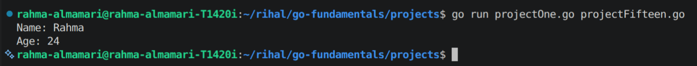
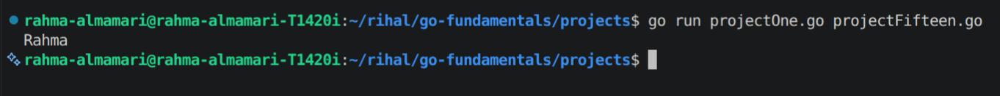

# Receiver Functions in Go

## What is a Receiver Function?

A **receiver function** (also called a **method**) is a function that belongs to a specific type.

Unlike normal functions, receiver functions are attached to a type (usually a struct), allowing that type to have its own behaviors.

---

# Why Use Receiver Functions?

Receiver functions help you:

- Organize code related to a specific type.
- Make structs more powerful by adding behaviors.
- Write cleaner and more readable code.

Instead of:

```go
printUser(user)
```

You can write:

```go
user.Print()
```

---

# Receiver Function Syntax

```go
func (receiverName ReceiverType) functionName() {
	// logic
}
```

Example:

```go
type User struct {
	Name string
}

func (u User) SayHello() {
	fmt.Println("Hello", u.Name)
}
```

Here:

- `u` is the receiver.
- `User` is the receiver type.
- `SayHello()` is the receiver function.

---

# Example: Receiver Function with Struct

```go
package main

import "fmt"

type User struct {
	Name string
	Age  int
}

func (u User) PrintInfo() {
	fmt.Println("Name:", u.Name)
	fmt.Println("Age:", u.Age)
}

func main() {

	user := User{
		Name: "Rahma",
		Age:  24,
	}

	user.PrintInfo()
}
```

**Code Output:**



---

# Value Receiver

A value receiver gets a **copy** of the struct.

Example:

```go
func (u User) ChangeName() {
	u.Name = "Ahmed"
}
```

The original value will not change.

```go
user.ChangeName()

fmt.Println(user.Name)
```

**Code Output:**



---

# Pointer Receiver

A pointer receiver works with the original struct, so it can modify its values.

Example:

```go
func (u *User) ChangeNameTwo() {
	u.Name = "Ahmed"
}
```

Usage:

```go
user.ChangeNameTwo()

fmt.Println(user.Name)
```

**Code Output:**


---

# Value Receiver vs Pointer Receiver

| Value Receiver | Pointer Receiver |
|---|---|
| Receives a copy | Receives the original value |
| Cannot modify original data | Can modify original data |
| Good for small structs | Good for large structs |
| Uses `(u User)` | Uses `(u *User)` |

---

# Important Notes

- Receiver functions are methods attached to a type.
- They are commonly used with structs.
- Value receivers do not change the original value.
- Pointer receivers can modify the original value.
- The receiver name is usually a short name related to the type (`u` for User).

---

# Summary

- A receiver function is a function that belongs to a type.
- It allows structs to have their own behaviors.
- Use value receivers when you only need to read data.
- Use pointer receivers when you need to update data.