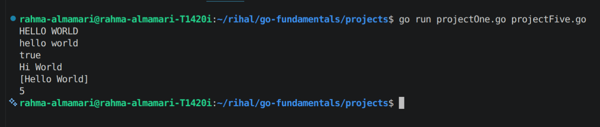
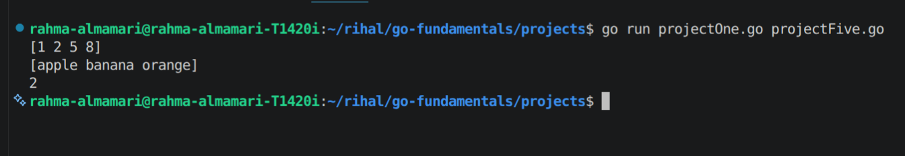

# The Standard Library

Go have so many packages just like **fmt package** and each of them have so many methods which we can used and here are some of them:

## strings packagae

Provides many useful functions for working with strings. It helps you search, modify, compare, and split text without writing loops manually.

| Function               | Description                                | Example                                          |
| ---------------------- | ------------------------------------------ | ------------------------------------------------ |
| `strings.Contains()`   | Checks if a string contains another string | `strings.Contains("hello", "he")` → `true`       |
| `strings.HasPrefix()`  | Checks if a string starts with a prefix    | `strings.HasPrefix("golang", "go")` → `true`     |
| `strings.HasSuffix()`  | Checks if a string ends with a suffix      | `strings.HasSuffix("file.txt", ".txt")` → `true` |
| `strings.ToUpper()`    | Converts a string to uppercase             | `"go"` → `"GO"`                                  |
| `strings.ToLower()`    | Converts a string to lowercase             | `"GO"` → `"go"`                                  |
| `strings.TrimSpace()`  | Removes leading and trailing spaces        | `" hello "` → `"hello"`                          |
| `strings.Split()`      | Splits a string into a slice               | `"a,b,c"` → `["a", "b", "c"]`                    |
| `strings.Join()`       | Joins a slice of strings into one string   | `["a","b"]` → `"a,b"`                            |
| `strings.ReplaceAll()` | Replaces all occurrences of a substring    | `"go go"` → `"golang golang"`                    |
| `strings.Count()`      | Counts occurrences of a substring          | `strings.Count("banana", "a")` → `3`             |
| `strings.Index()` | Find the index of something in string | `strings.Index("Rahma", "ma")` → `4` |

### Code Output:

## sort package

provides functions for sorting slices and searching within sorted data. It is commonly used when working with numbers, strings, and custom data types.

| Function                  | Description                                                     | Example                                                       |
| ------------------------- | --------------------------------------------------------------- | ------------------------------------------------------------- |
| `sort.Ints()`             | Sorts a slice of integers in ascending order                    | `[5,2,8,1]` → `[1,2,5,8]`                                     |
| `sort.Strings()`          | Sorts a slice of strings alphabetically                         | `["banana","apple","orange"]` → `["apple","banana","orange"]` |
| `sort.SearchInts()`       | Searches for an integer in a sorted slice and returns its index | Search `5` in `[1,2,5,8]` → `2`                               |
| `sort.Float64s()`         | Sorts a slice of float numbers                                  | `[3.2,1.5,2.8]` → `[1.5,2.8,3.2]`                             |
| `sort.IntsAreSorted()`    | Checks if an integer slice is already sorted                    | `[1,2,3]` → `true`                                            |
| `sort.StringsAreSorted()` | Checks if a string slice is already sorted                      | `["a","b","c"]` → `true`                                      |

### Code Output:

