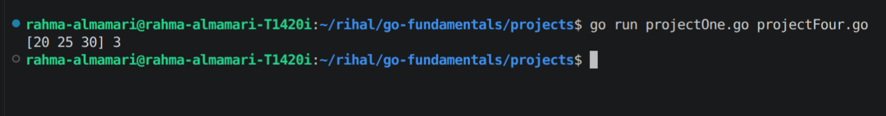
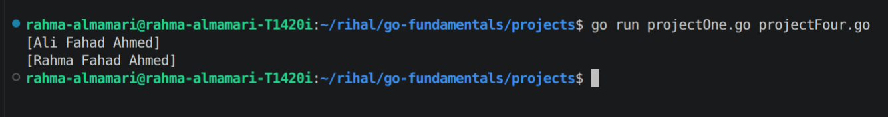
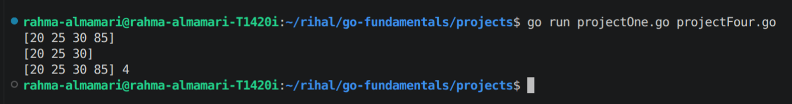
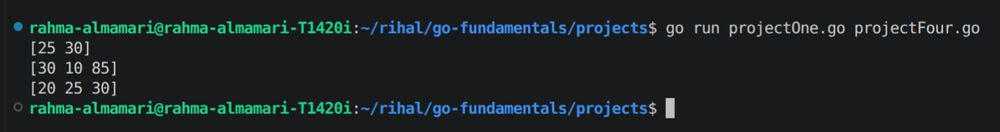

# Arrays & Slices

Arrays and slices are used to store collections of values in Go. An array has a fixed size that cannot be changed after creation, while a slice is a flexible and dynamic view over an array that can grow or shrink as needed.

## How to Declare Array in Go?

**Rolue**
`var array_name = [array_size]array_data_type{array_value1, ....}`

~~NOTE:~~

1. array is fix size which can not be change.
2. len() method use to print the size of array.

### Example:

```go
var ages = [3]int{20, 25, 30}
fmt.Println(ages, len(ages))
```

### Code Output:




## How to Change the value of Array in Go?

**Rolue**
`array_name[indxe] = new_value`

### Example:

```go
var names = [3]string{"Ali", "Fahad", "Ahmed"}
fmt.Println(names)

names[0] = "Rahma"
fmt.Println(names)
```

### Code Output:




## How to Declare Slice in Go?

**Rolue**
`var slice_name = []slice_data_type{slice_value1, ....}`

~~NOTE:~~ slice use array in the background and it is not a fix size.

### Example:

```go
var scores = []int{20, 25, 30}
fmt.Println(scores)
```

### Code Output:


## How to Change the value of Slice in Go?

**Rolue**
`slice_name[indxe] = new_value`

### Example:

```go
var names = []string{"Ali", "Fahad", "Ahmed"}
fmt.Println(names)

names[0] = "Rahma"
fmt.Println(names)
```

### Code Output:


## How to Append new value of Slice in Go?

**Rolue**
`append(slice_name_to_append_to, value)`

### Example:

```go
var scores = []int{20, 25, 30}
fmt.Println(append(scores, 85))
fmt.Println(scores)
// this way will not change the scores slice it will create new slice as a copy of scores slice
//and then add the appended value to new copy of scores
scores = append(scores, 85)
fmt.Println(scores, len(scores)) //this way will append the scores slice
```

### Code Output:




## Slice Ranges

### Example:

```go
var scores = []int{20, 25, 30, 10, 85}
marks := scores[1:3]
//it mean print from index 1 and stop print before index 3 so index 1 will be in the output but index 3 will not
fmt.Println(marks)
marksTwo := scores[2:]
//it mean print from index 2 until the end of the slice
fmt.Println(marksTwo)
marksThree := scores[:3]
//it mean print from the start of the slice 'index 0' until index 3 but do not print index 3
fmt.Println(marksThree)
```

### Code Output:




**~~NOTE:~~**

We can append a reange

```go
marksTwo = append(marksTwo, 99)
fmt.Println(marksTwo)
```
