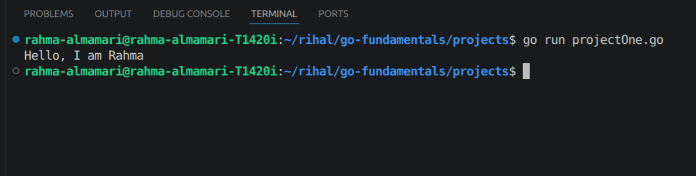

# Go Introduction

Go (Golang) is an open-source programming language developed by Google, designed to build reliable, efficient, and high-performance software. It provides a simple syntax, fast compilation, and powerful built-in features that make it suitable for modern application development.

## Go file structure

every file in go is a part of packcge which is a collection of files and codes.

```go

package main

import "fmt"

func main(){
    fmt.Println("Hello, I am Rahma")
}
```

### Code Explanation:

1. `package main` -> if the package called main this will tell the Go compiler that your code should compile to executable program.

2. `import "fmt"` -> here we import all the packages we need to use in the file. and we can import the package in two way the first one is if we have only one package to import like it show in the example the sconde one is when we have more than one package to import and for that we use () for example: 

```go
import (
    "fmt"
    "time"
)
```

3. `func main()` -> this is the entry point of our program. **every application has only and only one main() function**.

~~NOTE:~~ 

1. All functions in Go start with **func** keyword.

2. To run a file in Go do `go run file-name`

### Code Output:

