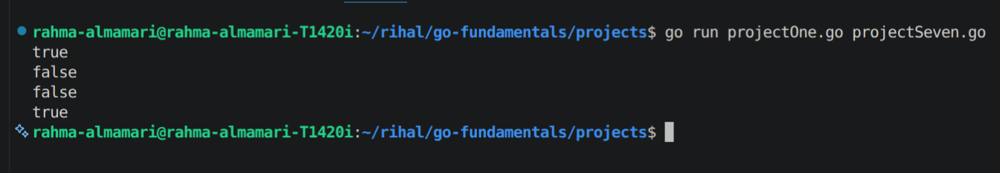
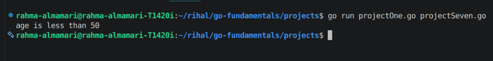

# Booleans & Conditionals

Booleans can be true(1) or false(0).

## Example:

```go 
age := 45

fmt.Println(age <= 50)
fmt.Println(age >= 50)
fmt.Println(age == 50)
fmt.Println(age != 50)

//output
//t
//f
//t
//t

```

### Code Output 




## if/else statement:

```go 
age := 45

if age < 30{
    fmt.Println("age is less than 30")
}else if age < 40 {
    fmt.Println("age is less than 40")
}else{
    fmt.Println("age is less than 50")
}

//output
//age is less than 50

```

### Code Output 

