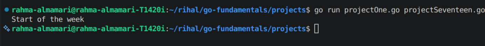
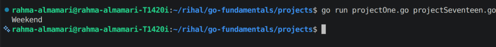
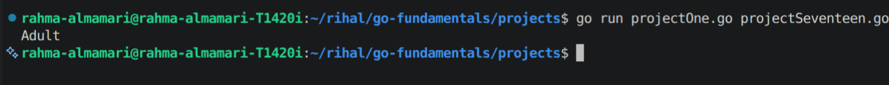
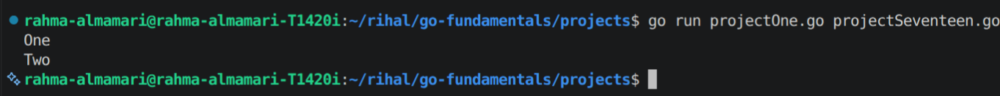

# Switch Statements in Go

## What is a Switch Statement?

A **switch statement** is used to execute different blocks of code based on the value of an expression.

It is a cleaner and more readable alternative to using multiple `if...else` statements.

---

# Switch Syntax

```go
switch expression {
case value1:
	// code
case value2:
	// code
default:
	// code
}
```

---

# Example: Basic Switch

```go
package main

import "fmt"

func main() {

	day := "Monday"

	switch day {
	case "Monday":
		fmt.Println("Start of the week")
	case "Friday":
		fmt.Println("Almost weekend")
	default:
		fmt.Println("Regular day")
	}
}
```

**Code Output:**



---

# Multiple Values in One Case

You can match multiple values in the same `case`.

```go
package main

import "fmt"

func main() {

	day := "Saturday"

	switch day {
	case "Saturday", "Sunday":
		fmt.Println("Weekend")
	default:
		fmt.Println("Weekday")
	}
}
```

**Code Output:**



---

# Switch Without an Expression

A switch can be used like an `if...else` statement.

```go
package main

import "fmt"

func main() {

	age := 20

	switch {
	case age < 18:
		fmt.Println("Minor")
	case age >= 18:
		fmt.Println("Adult")
	}
}
```

**Code Output:**



---

# Using `fallthrough`

The `fallthrough` keyword makes Go execute the next `case`, even if it doesn't match.

```go
package main

import "fmt"

func main() {

	number := 1

	switch number {
	case 1:
		fmt.Println("One")
		fallthrough
	case 2:
		fmt.Println("Two")
	}
}
```

**Code Output:**



> **Note:** `fallthrough` is not commonly used and should be used only when needed.

---

# Important Notes

- `switch` is an alternative to multiple `if...else` statements.
- Go automatically stops after a matching `case`; you don't need to write `break`.
- Use `default` when no case matches.
- A single `case` can match multiple values.
- `fallthrough` continues execution to the next case.

---

# Summary

- Use `switch` to choose between multiple conditions.
- It makes code cleaner and easier to read than long `if...else` chains.
- `default` runs when no case matches.
- Go automatically exits the `switch` after a matching case unless `fallthrough` is used.