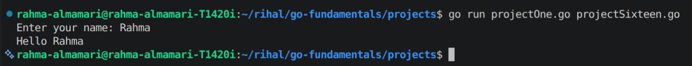
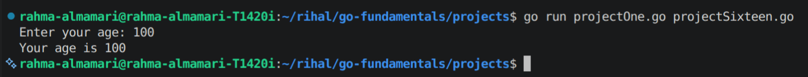
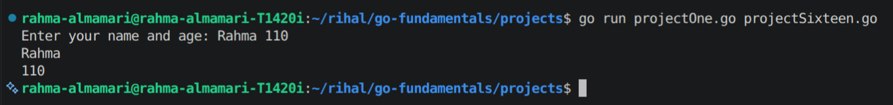
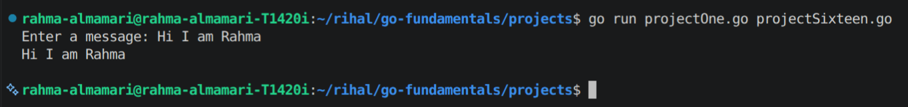

# User Input in Go

## What is User Input?

**User Input** means getting data from the user while the program is running.

In Go, we can read input from the terminal using the `fmt` package.

---

# Reading User Input Using `fmt.Scan()`

The `fmt.Scan()` function reads input from the user and stores it in a variable.

**Syntax**

```go
fmt.Scan(&variable)
```

> We use `&` because `Scan()` needs the memory address to update the variable.

---

# Example: Reading a Name

```go
package main

import "fmt"

func main() {

	var name string

	fmt.Print("Enter your name: ")

	fmt.Scan(&name)

	fmt.Println("Hello", name)
}
```

**Code Output:**



---

# Example: Reading an Integer

```go
package main

import "fmt"

func main() {

	var age int

	fmt.Print("Enter your age: ")

	fmt.Scan(&age)

	fmt.Println("Your age is", age)
}
```

**Code Output:**



---

# Reading Multiple Values

You can read multiple values using one `Scan()`.

```go
package main

import "fmt"

func main() {

	var name string
	var age int

	fmt.Print("Enter your name and age: ")

	fmt.Scan(&name, &age)

	fmt.Println(name)
	fmt.Println(age)
}
```

**Code Output:**



---

# Using `bufio` for Full Line Input

`fmt.Scan()` stops reading when it finds a space.

For reading a full sentence, use `bufio.Scanner`.

Example:

```go
package main

import (
	"bufio"
	"fmt"
	"os"
)

func main() {

	reader := bufio.NewReader(os.Stdin)

	fmt.Print("Enter a message: ")

	message, _ := reader.ReadString('\n')

	fmt.Println(message)
}
```

**Code Output:**



---

# Important Notes

- Use `fmt.Scan()` for simple inputs.
- Use `bufio.Scanner` or `bufio.Reader` for reading full lines.
- Use `&` when passing variables to input functions.
- The variable type must match the input type.

---

# Summary

- User input allows programs to receive data from users.
- `fmt.Scan()` is used for simple input.
- `&` passes the variable's memory address.
- Use `bufio` when you need to read complete sentences.