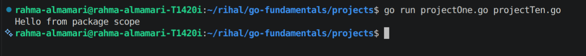
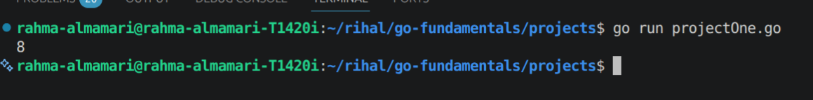
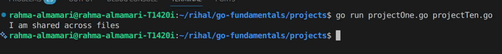
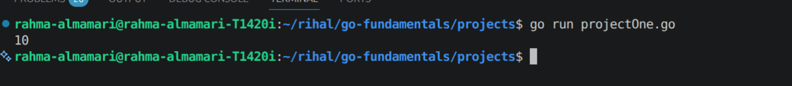

# Package Scope

In Go, scope defines where a variable, function, or type can be accessed. 

When we talk about package scope, we mean:

**Anything declared inside a package is accessible across all files inside the same package, but may or may not be accessible outside the package depending on naming rules.**

Go uses a simple rule to control visibility:
- If a name starts with a capital letter -> **it is exported (public)**
- If a name starts with a small letter -> **it is unexported (private to the package)**

## Types of Scope in Go

### 1. Package-Level Scope

Variables/functions declared outside any function belong to the package scope.

They can be used anywhere inside the same package.

**Example:**

```go
package main

import "fmt"

var message = "Hello from package scope"

func showMessage() {
	fmt.Println(message)
}

---

func main() {
	showMessage()
}
```

**Code Output:**



### 2. Exported vs Unexported (Very Important)

Go does not use keywords like `public` or `private`.

Instead, it uses **naming convention**.

**Rule:**

- CapitalizedName -> exported (accessible from other packages)
- lowercaseName -> unexported (only inside same package)

**Example:**

```go
package sup

import "fmt"

// Exported function (public)
func Add(a int, b int) int {
	return a + b
}

// Unexported function (private to package)
func logResult(result int) {
	fmt.Println("Result is:", result)
}

---

package main

import (
	"fmt"
	"go-fundamentals/projects/sup"
)

func main() {
	sum := mathutil.Add(5, 3)
	fmt.Println(sum)

	// Not allowed (unexported)
	// mathutil.logResult(sum)
}
```

**Code Output:**



### 3. Package Scope Across Multiple Files

All `.go` files inside the same folder belong to the same package and share package-level variables and functions.

**Example:**

```go
//file: a.go
package main

import "fmt"

var shared = "I am shared across files"

func printShared() {
	fmt.Println(shared)
}

---
//file: b.go
package main

func main() {
	printShared()
}
```

**Code Output:**



### 4. Local Scope (Function Scope)

Variables declared inside a function are only accessible within that function.

**Example:**

```go
package main

import "fmt"

func test() {
	x := 10
	fmt.Println(x)
}

---

func main() {
	test()

	// Not allowed
	// fmt.Println(x)
}
```

**Code Output:**




## Key Rules

- Package-level variables/functions are accessible across all files in the same package.
- Capitalized identifiers are exported (public).
- Lowercase identifiers are unexported (private).
- Files in the same package share the same scope.
- Function variables are limited to local scope.

## Summary Table

| Type                   | Scope           | Accessibility             |
| ---------------------- | --------------- | ------------------------- |
| Local variable         | Inside function | Only inside function      |
| Package-level variable | Inside package  | All files in package      |
| Capitalized name       | Exported        | Other packages can access |
| Lowercase name         | Unexported      | Same package only         |
