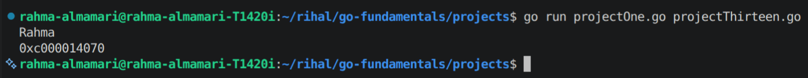
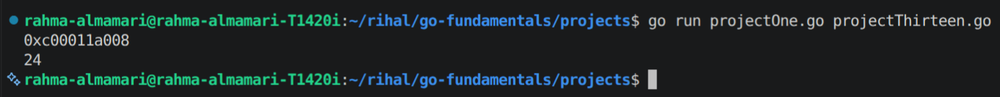
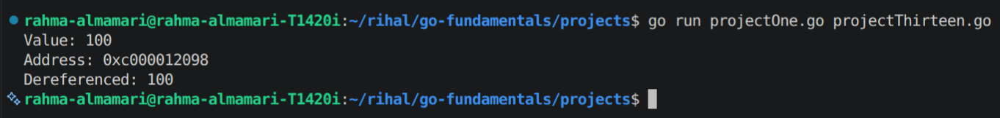
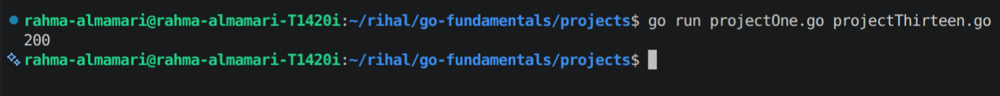
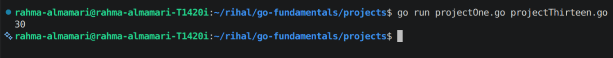

# Pointers in Go

## What is a Pointer?

A **pointer** is a variable that stores the **memory address** of another variable.

Instead of holding the actual value, a pointer tells you **where the value is stored in memory**.

Pointers are useful when you want a function to modify the original variable instead of working on a copy.

---

# Why Use Pointers?

Pointers are commonly used to:

- Modify the original value inside a function.
- Avoid copying large amounts of data.
- Improve performance when working with large structs.
- Share data between different parts of a program.

---

# Memory Representation

Suppose we have the following variable:

```go
age := 24
```

It might be stored in memory like this:

```
Variable        Value        Memory Address
-------------------------------------------
age             24           0x100
```

Now create a pointer:

```go
ptr := &age
```

```
Variable        Value
-----------------------------
age             24

ptr ---------> Memory Address of age
                │
                ▼
             +-------+
0x100 -----> |  24   |
             +-------+
```

The pointer stores the address of `age`, not its value.

---

# The Address Operator (`&`)

Use the `&` operator to get the memory address of a variable.

**Syntax**

```go
pointer := &variable
```

### Example

```go
package main

import "fmt"

func main() {
	name := "Rahma"

	fmt.Println(name)
	fmt.Println(&name)
}
```

**Possible Code Output:**




> **Note:** The memory address will be different each time you run the program.

---

# The Dereference Operator (`*`)

Use the `*` operator to access the value stored at a pointer's address.

**Syntax**

```go
*pointer
```

### Example

```go
package main

import "fmt"

func main() {
	age := 24

	ptr := &age

	fmt.Println(ptr)
	fmt.Println(*ptr)
}
```

**Possible Code Output:**



Here:

- `ptr` contains the memory address.
- `*ptr` accesses the value stored at that address.

---

# Creating a Pointer

```go
package main

import "fmt"

func main() {
	number := 100

	ptr := &number

	fmt.Println("Value:", number)
	fmt.Println("Address:", ptr)
	fmt.Println("Dereferenced:", *ptr)
}
```

**Possible Code Output:**



---

# Modifying a Value Through a Pointer

A pointer allows you to change the original variable.

```go
package main

import "fmt"

func main() {
	number := 50

	ptr := &number

	*ptr = 200

	fmt.Println(number)
}
```

**Possible Code Output:**



Changing `*ptr` changes the original variable because both refer to the same memory location.

---

# Passing a Pointer to a Function

Pointers are commonly used when a function needs to modify the original value.

```go
package main

import "fmt"

func increasePointer(num *int) {
	*num = *num + 10
}

func main() {
	number := 20

	increasePointer(&number)

	fmt.Println(number)
}
```

**Possible Code Output:**



### Explanation

```
number = 20

        │
        ▼
increase(&number)

Function receives:

*num

which points to

number

Changing:

*num = 30

Original variable becomes:

number = 30
```

Unlike pass by value, no copy of the integer is modified.

---

# Pointer Parameters

Function definition:

```go
func update(value *int) {
	*value = 100
}
```

Function call:

```go
number := 50

update(&number)
```

Result:

```
number = 100
```
