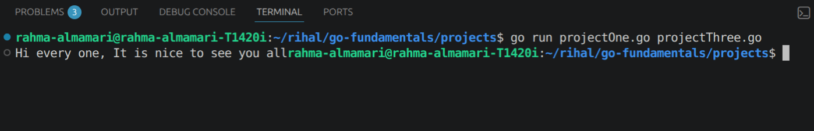
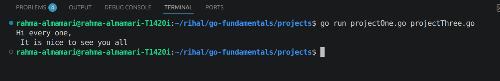
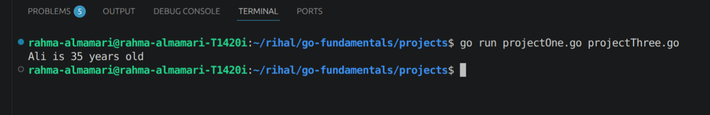
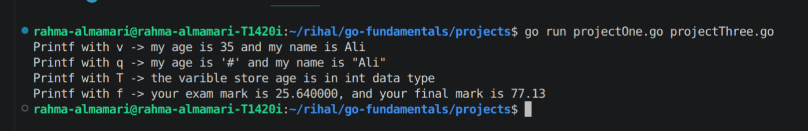
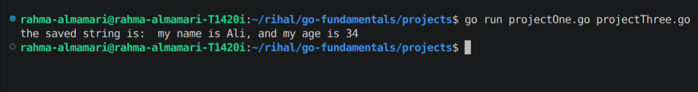

# Printing & Formatting Strings

In Go we have **fmt** package which use for formatting and print string to the console. it has so many methods for that for example:

## Print Method

this method do not give a new line.

```go 
fmt.Print("Hi every one,")
fmt.Print(" It is nice to see you all")
```
~~NOTE:~~ we can go to next line by using `\n`

### Code Output:



## Println Method

this method give a new line.

```go 
fmt.Println("Hi every one,")
fmt.Println(" It is nice to see you all")
```

### Code Output:



~~NOTE:~~

we can use **Print Method** and **Println Method** to variable alos:

```go 
age := 35
name := "Ali"

fmt.Print(name, " is ", age, " years old\n")
```

### Code Output:




## Printf Method

this method formate the string in so many way and it do not add new line.

1. `fmt.Printf("Printf with v -> my age is %v and my name is %v\n", age, name)` -> here Printf will print the string and when ever it found **%v** it will replace it with the variable we pass for it and it do the in oreder so we have to pass the variable in the right order.

2. `fmt.Printf("Printf with q -> my age is %q and my name is %q\n", age, name)` -> here the **%q** will do same like %v the only different is it will print the varible with "" and for that if we use **%q** for int variable it will print something like "#####"

3. `fmt.Printf("Printf with T -> the varible store age is in %T data type\n", age)` -> here the **%T** will print the data type of the varible not it's value.

4. `fmt.Printf("Printf with f -> your exam mark is %f, and your final mark is %00.2f", examMark, finalMark)` -> here the **%f** will print float and **%0.2f** will print float and after the **.** will print 2 number only.

### Code Output:




## Sprintf Method

this method will not print to the console it will save the string to a variable which we can print leater.

```go 
name := "Ali"
age := 34
var str := fmt.Sprintf("my name is %v, and my age is %v", name, age)
fmt.Println("the saved string is: ", srt)
```

### Code Output:



