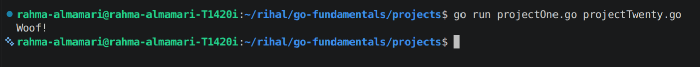
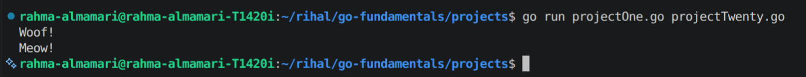

# Interfaces in Go

## What is an Interface?

An **interface** is a type that defines a set of **methods**.

Any type that implements those methods automatically satisfies the interface.

This allows different types to be used in the same way.

---

# Why Use Interfaces?

Interfaces help you:

- Write flexible code.
- Reuse functions with different types.
- Make your code easier to maintain.

---

# Declaring an Interface

**Syntax**

```go
type InterfaceName interface {
	MethodName()
}
```

Example:

```go
type Speaker interface {
	Speak()
}
```

Any type with a `Speak()` method satisfies the `Speaker` interface.

---

# Example

```go
package main

import "fmt"

type Speaker interface {
	Speak()
}

type Dog struct{}

func (d Dog) Speak() {
	fmt.Println("Woof!")
}

func main() {
	var s Speaker

	s = Dog{}

	s.Speak()
}
```

**Code Output:**



---

# Multiple Types Can Use the Same Interface

```go
package main

import "fmt"

type Speaker interface {
	Speak()
}

type Dog struct{}

func (d Dog) Speak() {
	fmt.Println("Woof!")
}

type Cat struct{}

func (c Cat) Speak() {
	fmt.Println("Meow!")
}

func makeSound(s Speaker) {
	s.Speak()
}

func main() {
	makeSound(Dog{})
	makeSound(Cat{})
}
```

**Code Output:**



Both `Dog` and `Cat` satisfy the `Speaker` interface because they both implement `Speak()`.

---

# Empty Interface

The empty interface has no methods.

```go
interface{}
```

Since every type has zero or more methods, **all types satisfy the empty interface**.

Example:

```go
var value interface{}

value = "Hello"
value = 100
value = true
```

The variable can store values of different types.

> **Note:** In modern Go, `any` is an alias for `interface{}` and is commonly used instead.

---

# Important Notes

- An interface defines **behavior**, not data.
- A type satisfies an interface by implementing its methods.
- You do **not** use a special keyword like `implements`.
- A function can accept an interface to work with different types.
- `any` is the same as `interface{}`.

---

# Summary

- An interface defines a set of methods.
- Any type that implements those methods satisfies the interface.
- Interfaces make code more flexible and reusable.
- Multiple types can use the same interface.
- `any` (or `interface{}`) can hold a value of any type.