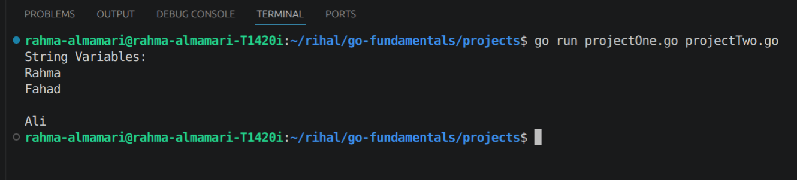
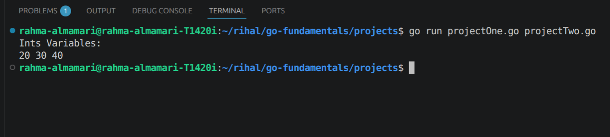
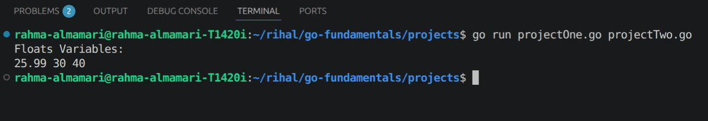

# Variables, Strings & Numbers

In Go if we create a variable we have to use it or it will will consider as error.

## Create String Variable

we can create a string variable in Go in so mane ways:

1. `var nameOne string = "Rahma"` -> string should be in "" not without it or we can use ''.

2. `var nameTwo = "Fahad"` -> here Go will understand that nameTwo is string even if we do not use string keyword.

3. `var nameThree string` -> here we create the variable and set it to string data type but we do not give it value and by default Go will give it value of "" empty string.

4. `nameFour := "Ali"` -> here we use **:=** which called **short variable declaration operator** and it is used to declare and initialize a variable at the same time without explicitly writing var, we can use this operator only inside a function.
 
### Code Output:

## Create Int Variable

we can create a Int variable in Go in so mane ways:

1. `var ageOne int = 20`
2. `var ageTwo = 30`
3. `ageThree := 40`

~~NTOE:~~ the default value of Int in Go is 0.

### Code Output:

**Ints Bits and Memory**

Int has different size in Go like:

- int (accept positive and negative numbers)
  - int
  - int8
  - int16
  - int32
  - int64

- uint (accept only positive numbers)
  - uint
  - uint8
  - uint16
  - uint32
  - uint64

## Create Float Variable

we can create a Float variable in Go in so mane ways:

1. `var scoreOne float32 = 25.99`
2. `var scoreTwo float64 = 8003.45`
3. `scoreThree := 66.32`

~~NTOE:~~ float has two size in Go (float32 and float64) and the default value of Float in Go is float64.

### Code Output:

