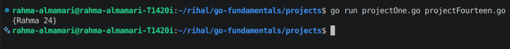
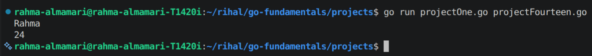
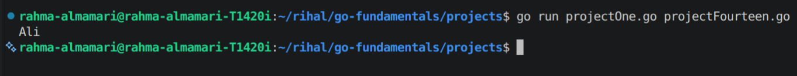
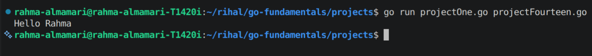
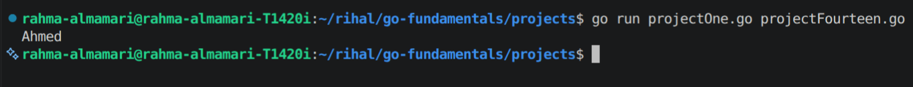

# Structs in Go

## What is a Struct?

A **struct** (short for structure) is a custom data type in Go that allows you to group related data together.

A struct contains **fields**, and each field can have a different data type.

For example, instead of storing user information separately:

```go
name := "Rahma"
age := 24
country := "Oman"
```

We can group them into one struct:

```go
type User struct {
	Name    string
	Age     int
	Country string
}
```

Now all user information is stored together.

---

# Why Use Structs?

Structs help you:

- Group related data.
- Create your own data types.
- Make your code cleaner and easier to maintain.
- Represent real-world objects.

Examples:

- User
- Product
- Employee
- Invoice
- Order

---

# Creating a Struct

**Syntax**

```go
type StructName struct {
	fieldName dataType
}
```

Example:

```go
type User struct {
	Name string
	Age  int
}
```

Here we created a new type called `User` with two fields:

- `Name` → string
- `Age` → int

---

# Creating a Struct Object

After defining a struct, we can create variables from it.

```go
package main

import "fmt"

type User struct {
	Name string
	Age  int
}

func main() {

	user := User{
		Name: "Rahma",
		Age:  24,
	}

	fmt.Println(user)
}
```

**Code Output:**



---

# Accessing Struct Fields

Use the dot (`.`) operator to access fields.

```go
fmt.Println(user.Name)
fmt.Println(user.Age)
```

**Code Output:**



---

# Updating Struct Fields

You can change field values directly.

```go
user.Age = 25

fmt.Println(user.Age)
```

**Code Output:**


---

# Struct with Multiple Fields

Example:

```go
type Employee struct {
	ID         int
	Name       string
	Department string
	Salary     float64
}

func main() {

	employee := Employee{
		ID:         1,
		Name:       "Ali",
		Department: "IT",
		Salary:     900,
	}

	fmt.Println(employee.Name)
}
```

**Code Output:**



---

# Structs with Functions

Structs can have functions called **methods**.

Example:

```go
package main

import "fmt"

type User struct {
	Name string
}

func (u User) SayHello() {
	fmt.Println("Hello", u.Name)
}

func main() {

	user := User{
		Name: "Rahma",
	}

	user.SayHello()
}
```

**Code Output:**



---

# Struct with Pointer

A pointer can be used to modify the original struct.

```go
func updateName(user *User) {
	user.Name = "Ahmed"
}

func main() {

	user := User{
		Name: "Rahma",
	}

	updateName(&user)

	fmt.Println(user.Name)
}
```

**Code Output:**



---

# Important Notes

- Structs are created using the `type` keyword.
- Struct fields can have different data types.
- Struct values are accessed using `.`.
- Structs are passed by value by default.
- Use pointers when you need to modify the original struct.
- Structs are commonly used to model real-world entities.

---

# Summary

- A **struct** groups related data into one object.
- Structs allow you to create your own custom types.
- Fields store the data inside a struct.
- Use `.` to access and update fields.
- Structs can have methods.
- Pointers can be used with structs to modify original data.