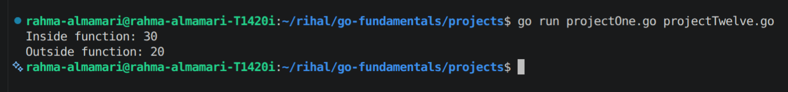
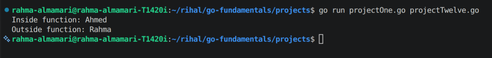
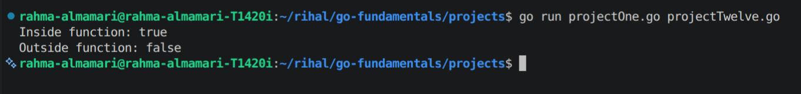
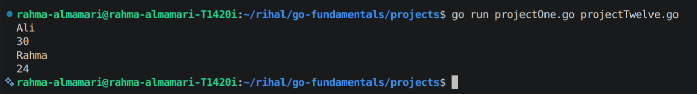
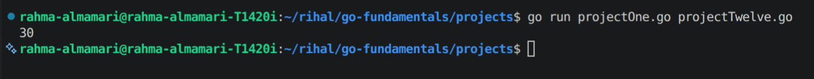
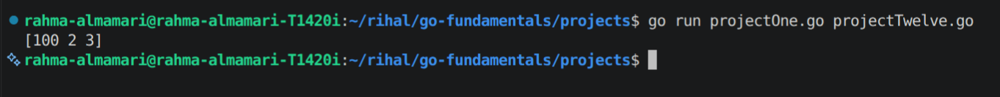
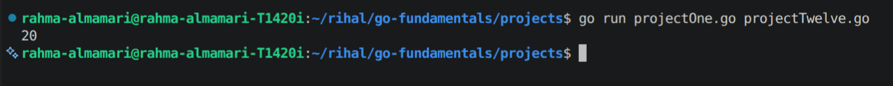

# Pass By Value in Go

## What is Pass By Value?

By default, **Go passes arguments to functions by value**.

This means that when you pass a variable to a function, Go creates a **copy** of that variable. The function works with the copy, **not the original variable**.

As a result:

- Changes made inside the function **do not affect** the original variable.
- The original value remains unchanged after the function returns.

---

# Why Does Go Use Pass By Value?

Passing values instead of the original variable helps make programs:

- Safer by preventing accidental modifications.
- Easier to understand.
- More predictable.
- Easier to debug.

If you want a function to modify the original variable, you must pass a **pointer** instead (covered in the Pointers section).

---

# How Pass By Value Works

Consider the following example:

```
Original Variable
        │
        ▼
     number = 10
        │
        │ Passed to function
        ▼
    Copy of number
        │
        ▼
 Function modifies the copy
        │
        ▼
Original variable is unchanged
```

---

# Example 1: Passing an Integer

```go
package main

import "fmt"

func increase(num int) {
	num = num + 10
	fmt.Println("Inside function:", num)
}

func main() {
	number := 20

	increase(number)

	fmt.Println("Outside function:", number)
}
```

**Code Output:**




### Explanation

When `number` is passed to `increase()`, Go creates a copy.

```
number = 20

        │
        ▼
increase(20)

Copy becomes 30

Original number remains 20
```

The function changes only the copied value.

---

# Example 2: Passing a String

```go
package main

import "fmt"

func changeName(name string) {
	name = "Ahmed"
	fmt.Println("Inside function:", name)
}

func main() {
	username := "Rahma"

	changeName(username)

	fmt.Println("Outside function:", username)
}
```

**Code Output:**




The original string is not modified.

---

# Example 3: Passing a Boolean

```go
package main

import "fmt"

func enable(status bool) {
	status = true
	fmt.Println("Inside function:", status)
}

func main() {
	isEnabled := false

	enable(isEnabled)

	fmt.Println("Outside function:", isEnabled)
}
```

**Code Output:**



Again, only the copied value changes.

---

# Example 4: Passing Multiple Values

Each argument passed to a function is copied independently.

```go
package main

import "fmt"

func update(name string, age int) {
	name = "Ali"
	age = 30

	fmt.Println(name)
	fmt.Println(age)
}

func main() {
	name := "Rahma"
	age := 24

	update(name, age)

	fmt.Println(name)
	fmt.Println(age)
}
```

**Code Output:**



Both original variables remain unchanged.

---

# Visual Example

```go
score := 90

update(score)
```

Memory representation:

```
Before function call

score
 └──► 90


Function call

update(score)

score
 └──► 90

copy
 └──► 90


Inside function

copy = 100

score
 └──► 90

copy
 └──► 100
```

Only the copy changes.

---

# Returning the Modified Value

Since the original value is not changed, a common approach is to return the new value.

```go
package main

import "fmt"

func increase(num int) int {
	return num + 10
}

func main() {
	number := 20

	number = increase(number)

	fmt.Println(number)
}
```

**Code Output:**



This is often preferred when you don't need to modify the original variable directly.

---

# Value Types in Go

The following types are passed by value:

- `int`
- `float32`
- `float64`
- `string`
- `bool`
- `byte`
- `rune`
- `struct`
- `array`

Each time one of these values is passed to a function, Go copies it.

---

# Important Note About Slices, Maps, and Channels

Slices, maps, and channels are also passed by value, **but the value being copied is a small descriptor that refers to shared underlying data**.

Because of this, modifying the underlying data inside a function is usually visible outside the function.

### Example with a Slice

```go
package main

import "fmt"

func change(numbers []int) {
	numbers[0] = 100
}

func main() {
	values := []int{1, 2, 3}

	change(values)

	fmt.Println(values)
}
```

**Code Output:**



Although the slice itself is passed by value, both the original slice and its copy refer to the same underlying array.

---

# Pass By Value vs Returning a Value

### Modifying a Copy

```go
func double(num int) {
	num = num * 2
}
```

Original value stays the same.

---

### Returning a New Value

```go
func double(num int) int {
	return num * 2
}
```

The caller can update the original variable.

```go
number = double(number)
```

---

# Common Mistake

Many beginners expect this code to change the original variable:

```go
func changeAge(age int) {
	age = 30
}

func main() {
	age := 20

	changeAge(age)

	fmt.Println(age)
}
```

**Code Output:**



The function only changes its local copy.

---

# When Should You Use Pass By Value?

Pass by value is appropriate when:

- The function should not modify the original data.
- The data being passed is small.
- You want to avoid unintended side effects.
- You want your functions to be predictable and easier to test.

If a function needs to modify the original value, use a **pointer**.

---

# Summary

- Go passes function arguments **by value**.
- Passing a value creates a **copy** of the original variable.
- Changes inside the function do **not** affect the original value.
- Primitive types, arrays, and structs are copied when passed to functions.
- Slices, maps, and channels are also passed by value, but their copied descriptors still reference the same underlying data.
- To modify the original variable directly, pass a **pointer** instead.